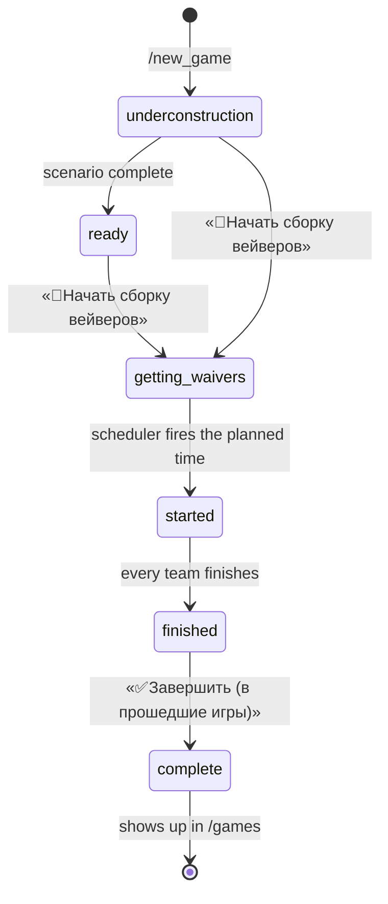

**Branch / commit under test:**
**Run by:**

Open this as an issue and tick as you go — GitHub only makes task lists
interactive in issues and comments, never when viewing a file.

The bot is a different bot depending on what the active game is doing. Most
routers switch themselves off once a game **starts**; waiver commands exist only
while it is **getting_waivers**; editing closes after that; results appear only
once it is **finished**. Testing one state therefore proves very little about
the others, which is why this pass is grouped by status rather than by feature.

Work through the states your change can reach and delete the rest — deleting a
section you didn't test beats ticking it untested.

Two things worth knowing before you file anything:

* Several buttons sit behind feature flags — `level_test`, `merge_team_button`,
  `tg_channel_publication`, `forum_publication`. A missing button may be config
  rather than a bug.
* Some checks below are marked **⚠ regression** — those are places that have
  broken before, so they are worth reading carefully rather than skimming.

## Accounts and fixtures

| | who |
|---|---|
| **A** | approved author (`can_be_author`), captain of a team, org of the test game |
| **B** | plain account, member of A's team, no team permissions |
| **C** | in no team, and never seen by the bot before — for the first-contact checks |
| **S** | listed in `superusers` |

Also: the team's group chat (a supergroup), one fresh group the bot was just
added to, and a game you can drive through the whole lifecycle.

## How the statuses connect

Only `getting_waivers`, `started` and `finished` count as **active**. Only
`started` switches the ordinary routers off. Editing is allowed up to and
including `getting_waivers`.

## 1. No active game

Peace time — everything that does not depend on a game. If your change touched
anything shared, this is the section to run.

- [ ] **A** — `/start`: main menu greets by name, shows the team flag, role emoji, and no active-game block.
- [ ] **C** — `/start`: greets by name and says they are in no team.
- [ ] `/me` → «Мой профиль»: key stats, correct-key ratio, team history.
- [ ] From the profile: change the displayed username, and request a one-time login link that opens the site.
- [ ] `/teams` → a team → its players and the numbers of games it played.
- [ ] **C** — `/team`, `/players`, `/leave` all answer «Ты не состоишь в команде».
- [ ] **A** — `/create_team` in a supergroup where you are an admin creates the team; the game-log chat gets a message.
- [ ] `/create_team` in a plain group returns the "convert to supergroup" hint instead.
- [ ] **A** — reply to someone in the team chat with `/add_in_team водитель`: added with that role, team notified.
- [ ] **A** — add C to the team chat and **read the name in the prompt**: «Принять **C** в команду …?» ⚠ regression — it has named the person doing the adding instead.
- [ ] Press «Принять»; repeat and press «Отказать». Neither answers «уже находится в команде».
- [ ] Add another bot to the team chat: no prompt at all.
- [ ] **A** — `/manage_team`: Captain's bridge with team name, motto, captain.
- [ ] **B** — `/manage_team` with no permissions: nothing happens. Grant only «Переименовывать команду» and it opens. ⚠ regression — this `or_f` branch is the fragile one.
- [ ] In the bridge: rename, change the motto, open «Игроки», flip a permission and watch the buttons follow it.
- [ ] «🔀Перенести в другой чат»: confirmation naming the old and new chat ids.
- [ ] «🔮Былые свершения команды» opens the merge dialog (flag `merge_team_button`).
- [ ] **A → C** — inline «Аппрувнуть»: clicking **your own** button gives «ну и смысл?»; C clicking «согласен» promotes them. ⚠ regression — getting these two the wrong way round lets the inviter approve themselves.
- [ ] **B** — `/new_game`, `/new_level`, `/levels`, `/my_games` get no reply at all (not an approved author).
- [ ] `/games`, `/chat_id`, `/chat_type`, `/about`, `/privacy`, `/help`, `/version` all answer.
- [ ] `/cancel` closes an open dialog.

## 2. `underconstruction` / `ready` — the game is being written

- [ ] **A** — `/new_level`: create a level with keys, time hints, conditions, bonus keys.
- [ ] `/levels` lists your free levels; open one and edit it.
- [ ] Level testing (flag `level_test`): start a test, submit a key in it, cancel it.
- [ ] Send a level to another org for testing and accept the invite from their account.
- [ ] `/new_game`: create a game from free levels.
- [ ] `/new_game` → upload a scenario zip instead: «Успешно сохранено».
- [ ] `/my_games` → the game → «📜Сценарий»: add and remove levels.
- [ ] «✏Переименовать» renames it.
- [ ] «👥Организаторы»: invite an org inline, and flip their permissions. Your own click on the invite gives «ну и смысл?».
- [ ] «📦zip-сценарий» downloads `scenario.zip`; «🔀Переходы» renders the transitions png.
- [ ] «🔑🧾Все ключи в xlsx» and «🔑🖨Ключи для печати» both produce a file.
- [ ] «📢Релиз»: attach a banner and hints.
- [ ] «📆Запланировать игру» sets a date and time; «📥Отменить игру» clears it.
- [ ] The game does **not** appear in `/games` yet.

## 3. `getting_waivers`

Reached with «📝Начать сборку вейверов» from the game menu.

- [ ] The transition posts to the game-log chat, and publishes the release to the channel if one exists (flag `tg_channel_publication`).
- [ ] `/start` main menu now shows the game, and your waiver status once you vote.
- [ ] **A** — `/waivers` posts the poll into the team chat.
- [ ] **B** — vote «Да», then change to «Нет»: the poll message updates each time.
- [ ] **B** — `/waivers` and `/approve_waivers` are refused — captain only.
- [ ] **A** — `/approve_waivers`: the bot writes to your DM with the draft.
- [ ] From there: approve the waivers, force-add a player, revoke someone's vote, and cancel the collection.
- [ ] **org** — `/get_waivers` and `/get_waivers_draft` render.
- [ ] Editing is still open: the scenario, orgs and rename all still work.
- [ ] Ordinary commands still answer — the routers switch off at `started`, not here. ⚠ regression — the gate reads "is the game *started*", and inverting it silently kills the bot outside games.

## 4. `started`

Reached when the scheduler fires the planned time.

- [ ] Teams receive the first level at the planned moment.
- [ ] A correct key from the team chat is accepted; a wrong one is rejected; bonus keys score.
- [ ] Timed hints arrive on their schedule.
- [ ] After a level change, hints from the previous level are not shown again.
- [ ] Teams sitting on different levels progress independently of each other.
- [ ] **A/B** — `/create_team`, `/my_games`, `/teams`, `/manage_team` all go quiet now. ⚠ regression — if they still answer mid-game the gate is inverted the other way.
- [ ] **org** — `/spy` opens; the spy view lists teams by level and updates as they move.
- [ ] **org without the right** — `/spy_levels` and `/spy_keys` stay silent; grant the rights and they open.
- [ ] **B** — `/spy` as a non-org does nothing.
- [ ] The spy «Лог ключей» button builds its Telegraph page.

## 5. `finished`

Every team has finished; the game is still active but no longer running.

- [ ] Ordinary commands answer again — `started` was the only status that muted them.
- [ ] The results picture renders.
- [ ] «✅Завершить (в прошедшие игры)» has appeared in the game menu.
- [ ] Keys log and zip export still work.

## 6. `complete`

- [ ] The game now appears in `/games`.
- [ ] Open it: waivers list, results picture, keys log link, zip, transitions, and the "scenario on the site" web-app button.
- [ ] The results picture renders. ⚠ If it fails with `MEDIA_EMPTY`, the cached `games.results_picture_file_id` was minted by a different bot token — file ids are per-bot. Clear the column and it re-renders.
- [ ] Publish to the forum (flag `forum_publication`) if your change touched it.

## 7. Independent of any game

Identity is resolved and written on every single update, whatever the game is
doing.

- [ ] **C** — from an account the bot has never seen, `/start` works: the user row and player are created by that first update.
- [ ] Change your Telegram **@username**, send any message, open `/me`: the new one shows. A stale one means the upsert stopped running.
- [ ] Change your **first name**, send any message, reopen `/start`: the greeting uses it.
- [ ] Rename the team's group chat, send a message there, `/who_there`: no error.
- [ ] Convert a plain group to a supergroup: the migration is handled without error and `/create_team` becomes available.
- [ ] Add the bot to a brand-new group and immediately `/chat_id`: both ids come back.
- [ ] Send commands as an **anonymous group admin**: a sensible answer or silence, never a traceback loop.
- [ ] Let a linked channel auto-forward a post into a group the bot is in: no error storm.
- [ ] **S** — `/merge_teams`, `/merge_players`: merged, logged, and the target's open dialog refreshes.
- [ ] **S** — `/jobs` lists scheduled jobs.

## 8. When something breaks

Handlers and filters are wired with dishka's `@inject`, which relies on aiogram
passing `dishka_container` to everything it calls. When that breaks it shows up
as one of these rather than as a wrong answer:

| signature | meaning |
|---|---|
| `TypeError: … missing 1 required … argument: 'dishka_container'` | the container never reached the callable |
| `KeyError: 'player'` / `'dao'` / `'game'` | something still reads a middleware-data key that no longer exists |
| a burst of `PlayerNotFoundError` / `ChatNotFound` | updates that used to carry `None` quietly now raise |
| a command that simply stops answering | a filter is returning `False` — check the game status it is gated on |

Grep the run for the first three while working through the list; the fourth only
shows up by noticing the bot went quiet, which is what the status grouping above
is for.
